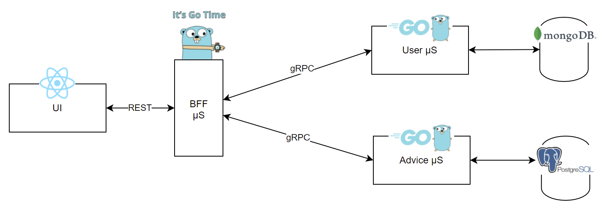
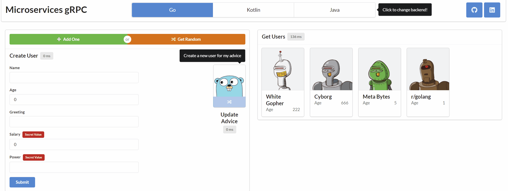

# Microservices Go gRPC

[Deployed in EC2, Check it out!](http://ec2-18-192-156-217.eu-central-1.compute.amazonaws.com/)

For more context, please read the [Medium Story](https://itnext.io/bff-pattern-with-go-microservices-using-rest-grpc-87d269bc2434) before checking the code


This repo contains microservices written in Go which aims to demonstrate BFF pattern by performing distributed CRUD operations.

See Also
- [Kotlin Spring Version](https://github.com/uid4oe/microservices-kotlin-grpc/)
- [Java Spring Version](https://github.com/uid4oe/microservices-java-grpc/)






## Installation
Clone the repository
```bash
git clone https://github.com/uid4oe/microservices-go-grpc.git
```

You should have Docker installed beforehand.

`.env` is included. You just need to create network & execute `docker-compose` command

```bash
docker network create uid4oe
docker-compose up -d
```

At this point everything should be up and running! You can access to UI at 

```bash
http://localhost:3000
```

Additionally, you may take a look at [Microservices gRPC UI](https://github.com/uid4oe/microservices-grpc-ui/) for the UI code.

## Local Development
For running services in local environment, you will need a MongoDB & PostgreSQL instance, you can use `local.yml`
It will set up MongoDB, PostgreSQL and UI.

```bash
docker network create uid4oe
docker compose --file local.yml up -d
```

Now lets start microservices locally.
```bash
bash start-local.sh
```
or 
```bash
start-local.bat
```

That's great. Now we can use the app through UI at

```bash
http://localhost:3000
```

## Contributing
Pull requests are welcome. For major changes, please open an issue first to discuss what you would like to change.


